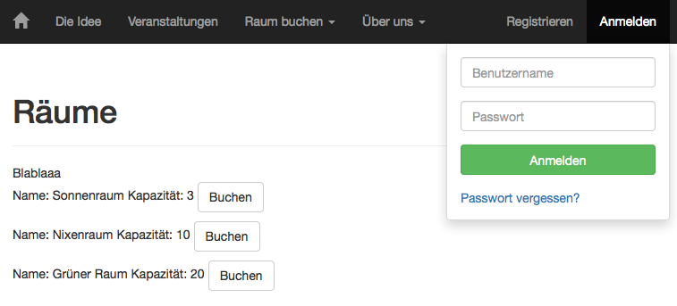

A room booking webapp included in a content management system.

Frameworks used:

- The CMS [Wagtail](http://wagtail.io/)
- The high-level Python Web framework [Django](https://www.djangoproject.com/)


# Features
- Create rooms in the admin interface below "Snippets"
- Rooms and bookings are listed on corresponding webpages
- A visitor can create an user account
- A user can book a room

# Setup
- Install Python 3, then execute in Terminal / cmd.exe: `sudo pip install -r requirements.txt`
- At the end of the file `wagtail_room-booking/settings/base.py` specify with `WEEKLY_VIEW_URL` which URL the week view 
will have and name the sites in wagtail admin accordingly later.

# Developement
Edit `models.py`, then run `python manage.py makemigrations`, `python manage.py migrate` to adapt your database. Run 
`python manage.py createsuperuser` once.
Run `python manage.py runserver` and open `http://127.0.0.1:8000`.
Go to `http://127.0.0.1:8000/admin` and create some rooms and sites.

You may want to use [PyCharm](https://www.jetbrains.com/pycharm/) for developing because it automatically restarts 
the server on code changes.  


# Combination of Wagtail and Django
- We define a `Room` in `models.py` and register it as a snippet.  We also define a `Booking` which always belongs to
 a room.
- At `room_booker_tags.py` we define the tag `rooms`, which returns the rooms from the database. This tag can be used 
in html templates with `` after loading the tags with ``. To each tag belongs a 
html file with the same name which defines how the rooms are visualized in html.
- With `<a href="">Book room</a>` we call the view with the name `booking_page` and 
pass the parameter `room.pk`. In `urls.py` we defined that with that name we show `booking_page/1` in the url bar and 
call the imported view function 
`booking_page`: `url(r'^booking_page/(?P<room_id>.*)/$', booking_page, name='booking_page')`
- In `views.py` we defined that function:

	```
	def booking_page(request, room_id):
	    room = get_object_or_404(Room, pk=room_id)
	    return render(request, 'room_booker/booking_page.html', {'room': room})
	```
	We get the Room with that primary key from the database and pass it to the html template `booking_page.html`.


# Hosting
Add to settings/base.py

```
USE_X_FORWARDED_HOST = True
ALLOWED_HOSTS = [
    'your.complete.domain.de
]
```
Run somehow with gunicorn.

# Screenshot

